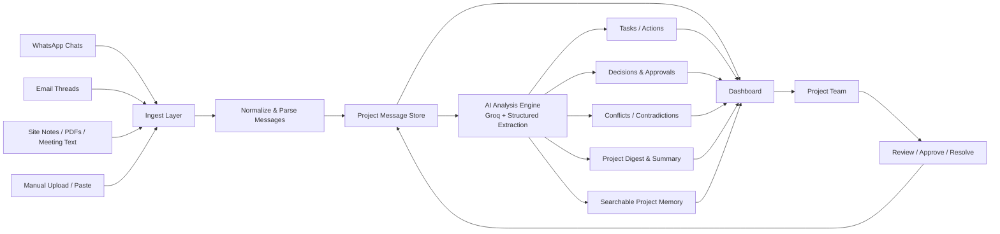

# Keystone Architecture Diagram

## What this system does
- Captures communication from multiple sources
- Converts raw updates into structured project data
- Extracts tasks, deadlines, approvals, and contradictions
- Stores all history in a searchable memory layer
- Helps the team review and act on the latest project status quickly

## Demo note
This diagram shows the real architecture of the app in a way that is easy to present during a project demo without exposing the underlying implementation complexity.
